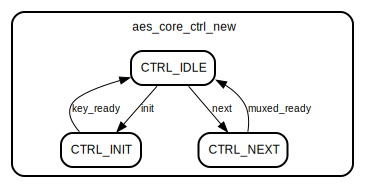

# Entity: aes_core 
- **File**: aes_core.v

## Diagram

## Ports

| Port name    | Direction | Type           | Description |
| ------------ | --------- | -------------- | ----------- |
| clk          | input     | wire           |             |
| reset_n      | input     | wire           |             |
| encdec       | input     | wire           |             |
| init         | input     | wire           |             |
| next         | input     | wire           |             |
| ready        | output    | wire           |             |
| key          | input     | wire [255 : 0] |             |
| keylen       | input     | wire           |             |
| block        | input     | wire [127 : 0] |             |
| result       | output    | wire [127 : 0] |             |
| result_valid | output    | wire           |             |

## Signals

| Name              | Type           | Description |
| ----------------- | -------------- | ----------- |
| aes_core_ctrl_reg | reg [1 : 0]    |             |
| aes_core_ctrl_new | reg [1 : 0]    |             |
| aes_core_ctrl_we  | reg            |             |
| result_valid_reg  | reg            |             |
| result_valid_new  | reg            |             |
| result_valid_we   | reg            |             |
| ready_reg         | reg            |             |
| ready_new         | reg            |             |
| ready_we          | reg            |             |
| init_state        | reg            |             |
| round_key         | wire [127 : 0] |             |
| key_ready         | wire           |             |
| enc_next          | reg            |             |
| enc_round_nr      | wire [3 : 0]   |             |
| enc_new_block     | wire [127 : 0] |             |
| enc_ready         | wire           |             |
| enc_sboxw         | wire [31 : 0]  |             |
| dec_next          | reg            |             |
| dec_round_nr      | wire [3 : 0]   |             |
| dec_new_block     | wire [127 : 0] |             |
| dec_ready         | wire           |             |
| muxed_new_block   | reg [127 : 0]  |             |
| muxed_round_nr    | reg [3 : 0]    |             |
| muxed_ready       | reg            |             |
| keymem_sboxw      | wire [31 : 0]  |             |
| muxed_sboxw       | reg [31 : 0]   |             |
| new_sboxw         | wire [31 : 0]  |             |

## Constants

| Name      | Type | Value | Description |
| --------- | ---- | ----- | ----------- |
| CTRL_IDLE |      | 2'h0  |             |
| CTRL_INIT |      | 2'h1  |             |
| CTRL_NEXT |      | 2'h2  |             |

## Processes
- reg_update: ( @ (posedge clk or negedge reset_n) )
  - **Type:** always
- sbox_mux: ( @* )
  - **Type:** always
- encdec_mux: ( @* )
  - **Type:** always
- aes_core_ctrl: ( @* )
  - **Type:** always

## Instantiations

- enc_block: aes_encipher_block
- dec_block: aes_decipher_block
- keymem: aes_key_mem
- sbox_inst: aes_sbox

## State machines

