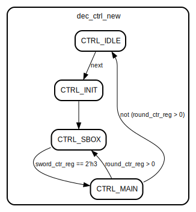

# Entity: aes_decipher_block 
- **File**: aes_decipher_block.v

## Diagram

## Ports

| Port name | Direction | Type           | Description |
| --------- | --------- | -------------- | ----------- |
| clk       | input     | wire           |             |
| reset_n   | input     | wire           |             |
| next      | input     | wire           |             |
| keylen    | input     | wire           |             |
| round     | output    | wire [3 : 0]   |             |
| round_key | input     | wire [127 : 0] |             |
| block     | input     | wire [127 : 0] |             |
| new_block | output    | wire [127 : 0] |             |
| ready     | output    | wire           |             |

## Signals

| Name          | Type          | Description |
| ------------- | ------------- | ----------- |
| sword_ctr_reg | reg [1 : 0]   |             |
| sword_ctr_new | reg [1 : 0]   |             |
| sword_ctr_we  | reg           |             |
| sword_ctr_inc | reg           |             |
| sword_ctr_rst | reg           |             |
| round_ctr_reg | reg [3 : 0]   |             |
| round_ctr_new | reg [3 : 0]   |             |
| round_ctr_we  | reg           |             |
| round_ctr_set | reg           |             |
| round_ctr_dec | reg           |             |
| block_new     | reg [127 : 0] |             |
| block_w0_reg  | reg [31 : 0]  |             |
| block_w1_reg  | reg [31 : 0]  |             |
| block_w2_reg  | reg [31 : 0]  |             |
| block_w3_reg  | reg [31 : 0]  |             |
| block_w0_we   | reg           |             |
| block_w1_we   | reg           |             |
| block_w2_we   | reg           |             |
| block_w3_we   | reg           |             |
| ready_reg     | reg           |             |
| ready_new     | reg           |             |
| ready_we      | reg           |             |
| dec_ctrl_reg  | reg [2 : 0]   |             |
| dec_ctrl_new  | reg [2 : 0]   |             |
| dec_ctrl_we   | reg           |             |
| tmp_sboxw     | reg [31 : 0]  |             |
| new_sboxw     | wire [31 : 0] |             |
| update_type   | reg [2 : 0]   |             |

## Constants

| Name            | Type | Value | Description |
| --------------- | ---- | ----- | ----------- |
| AES_128_BIT_KEY |      | 1'h0  |             |
| AES_256_BIT_KEY |      | 1'h1  |             |
| AES128_ROUNDS   |      | 4'ha  |             |
| AES256_ROUNDS   |      | 4'he  |             |
| NO_UPDATE       |      | 3'h0  |             |
| INIT_UPDATE     |      | 3'h1  |             |
| SBOX_UPDATE     |      | 3'h2  |             |
| MAIN_UPDATE     |      | 3'h3  |             |
| FINAL_UPDATE    |      | 3'h4  |             |
| CTRL_IDLE       |      | 3'h0  |             |
| CTRL_INIT       |      | 3'h1  |             |
| CTRL_SBOX       |      | 3'h2  |             |
| CTRL_MAIN       |      | 3'h3  |             |
| CTRL_FINAL      |      | 3'h4  |             |

## Functions
- gm2 (input [7 : 0] op) return ([7 : 0])
- gm3 (input [7 : 0] op) return ([7 : 0])
- gm4 (input [7 : 0] op) return ([7 : 0])
- gm8 (input [7 : 0] op) return ([7 : 0])
- gm09 (input [7 : 0] op) return ([7 : 0])
- gm11 (input [7 : 0] op) return ([7 : 0])
- gm13 (input [7 : 0] op) return ([7 : 0])
- gm14 (input [7 : 0] op) return ([7 : 0])
- inv_mixw (input [31 : 0] w) return ([31 : 0])
- inv_mixcolumns (input [127 : 0] data) return ([127 : 0])
- inv_shiftrows (input [127 : 0] data) return ([127 : 0])
- addroundkey (input [127 : 0] data,  input [127 : 0] rkey) return ([127 : 0])

## Processes
- reg_update: ( @ (posedge clk or negedge reset_n) )
  - **Type:** always
- round_logic: ( @* )
  - **Type:** always
- sword_ctr: ( @* )
  - **Type:** always
- round_ctr: ( @* )
  - **Type:** always
- decipher_ctrl: ( @* )
  - **Type:** always

## Instantiations

- inv_sbox_inst: aes_inv_sbox

## State machines

